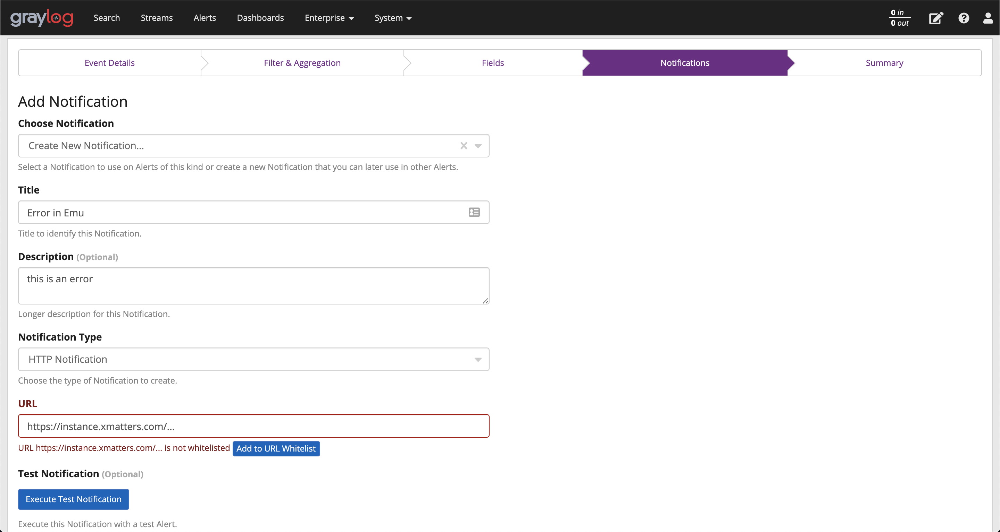
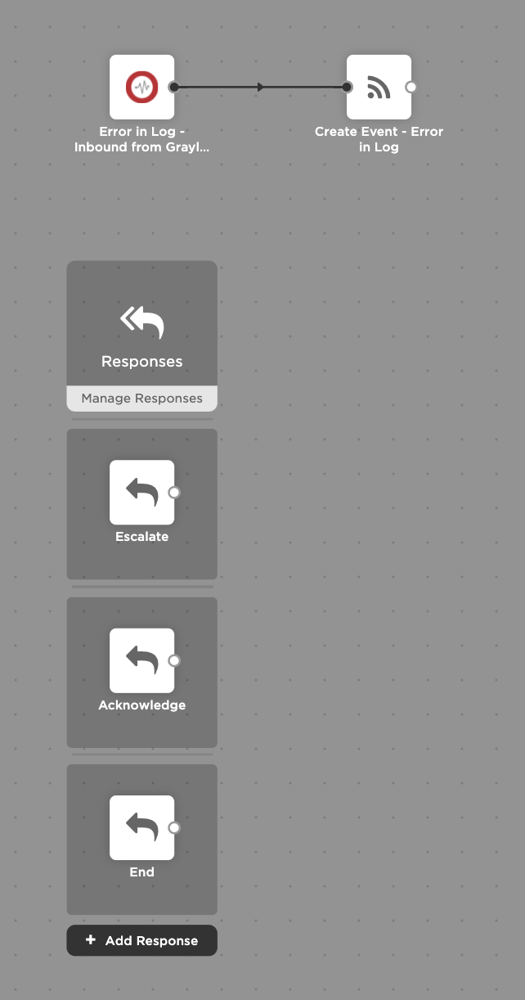

# Graylog Integration

This Integration allows you to create xMatters Events from Graylog Events.

---------

<kbd>
  
</kbd>

---------

# Files

* [Graylog.zip](Graylog.zip) - Workflow zip file with the step and example flow
* [graylog.png](/graylog.png) - Graylog logo

# Installation

## xMatters Setup
1. Download the [Graylog.zip](Graylog.zip) file onto your local computer
2. Navigate to the Workflows tab of your xMatters instance
3. Click Import, and select the zip file you just downloaded
4. Copy the URL from the **Inbound from Graylog** step. You'll need this when setting up the Graylog event.

## Graylog Setup
To connect xMatters to an event in Graylog,

1. Find the event you would like to trigger xMatters on. These are found under **Alerts > Event Definitions**
2. Edit the event.
3. Under the **Notifications** step, add a new notification.
4. Create a new Notification of type **HTTP Notification**

Click to reveal image

<kbd>

</kbd>

5. Put the URL that you copied from the xMatters **Inbound from Graylog** step and place it in the **URL** field.
6. Finish creating the event.

# Example
Here is what the included flow looks like.

<kbd>

</kbd>

